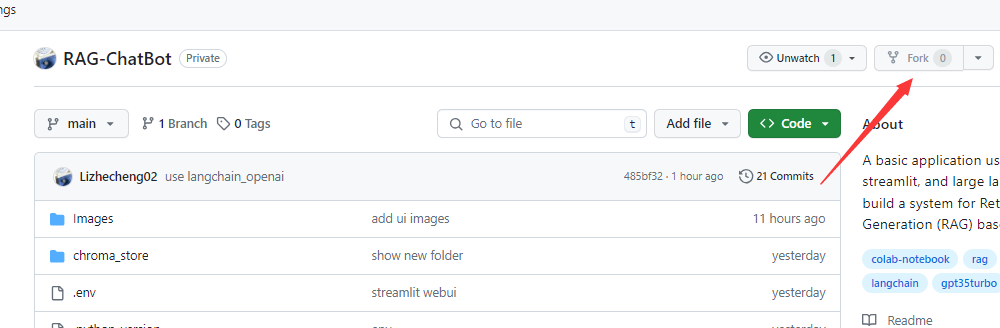

# Simple Question Answering using RAG Approach, Streamlit and Open AI Models
I modified some codes as my experiments that are taken from https://github.com/Lizhecheng02/RAG-ChatBot. Lizhecheng02 is the original author.

## Python Environment

### 1. Install Packages

```b
pip install -r requirements.txt
```

### 2. Set API Keys

- Create a new ``openai api key``, link: https://platform.openai.com/api-keys. The key will be pasted later in Advanced Settings of Streamlit on "Deploy an app" page. For example, OPENAI_API_KEY  = "xxxxx...."
- 

### 3. Compare RAG With Original ChatGPT
```
python compare.py
```
The code is almost the same as ``colab.ipynb``, just add the response from ``original ChatGPT``. When you enter the question, you can see responses from both ``RAG system`` and ``original ChatGPT``.

### 4. Deploy Your App
- Fork this GitHub repo into your own GitHub account



- Set your ``OPENAI_API_KEY`` in the ``.env`` file. (You need to clone the repo to local computer, change the file and commit it, or maybe you can delete this file and upload an another ``.env`` file)


- Go to https://share.streamlit.io/ and login with your GitHub account.
- Click **New app**.


- Enter your ``GitHub Repo Url`` in **Repository** and change the **Main file path** to ``app.py``


- Click **Deploy!**, wait for installing all packages in the ``requirements.txt``, you can see the progress.


- After it's done, you can use it.


- Now, you can share your app link with others. When you go back to https://share.streamlit.io/, you can see your application now.


### 6. Use Groq For Faster Inference

- Get your ``GROQ_API_KEY`` at https://console.groq.com/keys.

- Set your ``GROQ_API_KEY`` in the ``.env`` file.

- Follow all the steps in the **Part 7**, but change the **Main file path** to ``app-groq.py``

- Follow all the steps in the **Part 7**, but change the **Main file path** to ``app-llama.py``

### 7. Warning

Since others will be using your ``OPENAI_API_KEY``, ``GROQ_API_KEY`` and ``LLAMA_API_KEY`` when you share your app with them, all costs will be charged to your account. Be cautious when sharing it, and if needed, promptly delete the application you've deployed.

